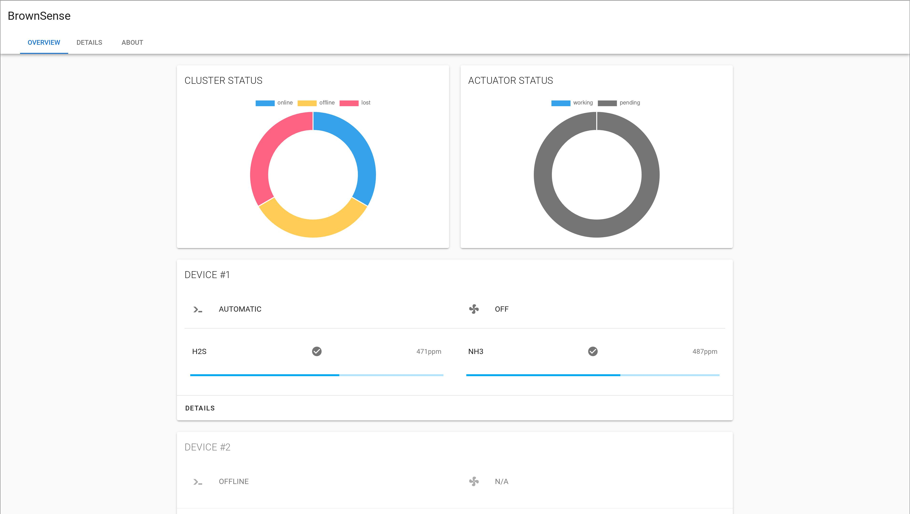
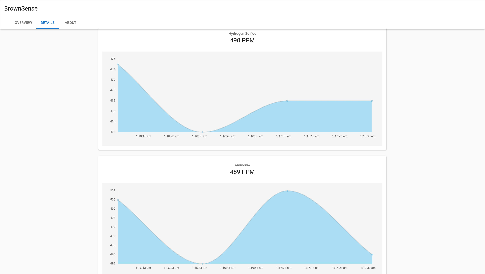

# BrownSense

🚽 A distributed IoT platform for monitoring and improving toilet's indoor air quality. 

> Work In Progress

## Demo

[Demo Page](https://brownsense.misaka.center/)

There are two data sources: dummy data generator and real readings from my dorm's toilet. Till now, all these data sources can't be trusted: the dummy data are in no way realistic for the generated concentration of hydrogen sulfide and ammonia is far above the lethal concentration, and the real data are simply multiplied voltage readings while the true value isn't linear with sensor Vout.

This site is deployed on Tencent Cloud, a cloud service provider in mainland China, and it's highly possible that you experience lags when you access this website from places outside mainland China.

## Screenshots

